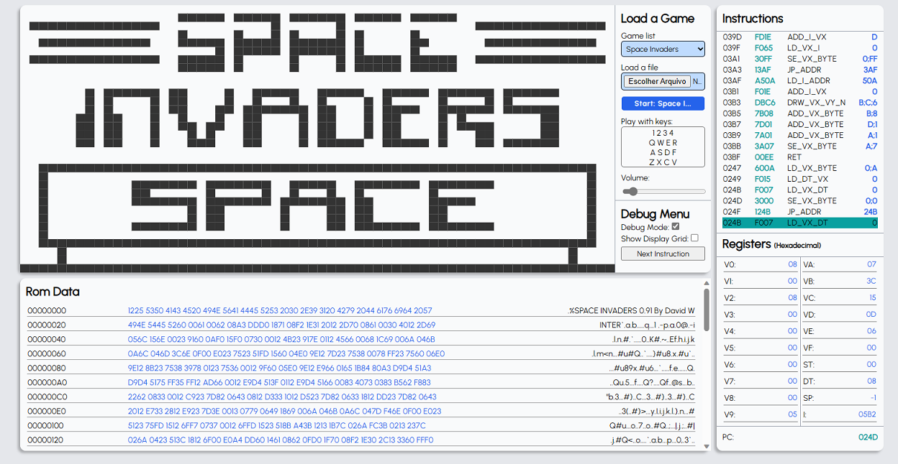

# ReChip8-JS



[](https://opensource.org/licenses/MIT)

Um emulador e debugger completo de Chip-8 com o núcleo escrito em JavaScript e grande parte do front-end utilizando ReactJS e Redux.
> CHIP-8 é uma linguagem de programação interpretada, desenvolvida por Joseph Weisbecker em meados dos anos 70. Os programas em CHIP-8 rodam em uma máquina virtual, o que permite que os softwares desenvolvidos utilizando essa linguagem, sejam bastante simples.


## Dependências
- Vite
- React
- React-Redux
- Redux

## Instalação

> Este guia assume que você já tenha o NodeJS e o npm instalados no seu computador.

Clonar o repositório e instalar.
```bash
git clone https://github.com/rt-moura/rechip8-js.git
cd rechip8-js
npm install
```

## Inicialização

```bash
npm run dev
```

Após o vite ser iniciado pressione a tecla **'o'** de *open* para abrir o navegador

## Uso

Você pode usar as seguintes teclas para utilizar o emulador:
> 1 2 3 4  
> Q W E R  
> A S D F  
> Z X C V  

Sabendo disso, basta carregar uma ROM de Chip-8. Isso pode ser feito de duas formas:
1. Selecionando uma por meio do campo *Game list*;  
2. Selecionando uma ROM do seu disco local usando o campo *Load a file*.  

Após selecionar a ROM basta clicar no botão **Start**

## Debugging

Para depurar uma ROM, é necessário selecionar ela e antes de clicar no botão *Start* deve-se marcar a opção **Debug Mode**. Feito isso um botão será exibido logo abaixo.  

Podemos então iniciar a ROM clicando no botão *Start*. Ela iniciará pausada por conta do *Debug Mode*.  

Ao clicar no botão **Next Instruction** uma instrução por vez será executada no processador do emulador, possibilitando a análise do código.  


## Build

Para *buildar* a aplicação execute:
```bash
npm run build
```